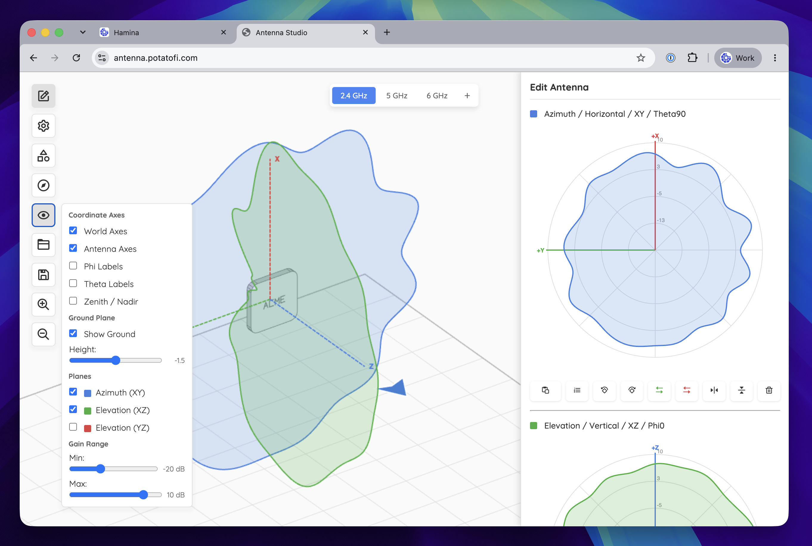
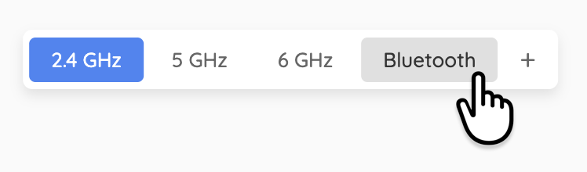
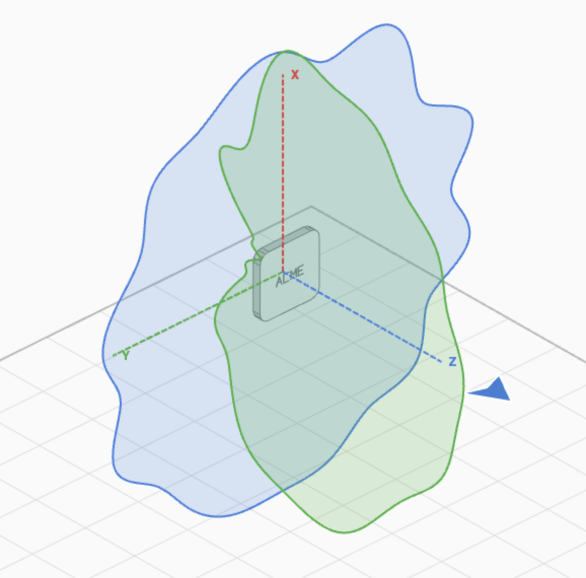

# Antenna Studio

This is a web-based tool for viewing, constructing, and editing antenna patterns.



## Controls

* **Orbit**: Left-click and drag.
* **Zoom in and out**: Use the scroll wheel, or hold the `Shift` key and left-click and drag vertically.

## Coordinate Systems

The tool has two coordinate systems:

1. **Local Coordinates** - These are local to the AP/antenna. In most cases, the beam should be directed in a Z+ direction. The antenna patterns are locked to the local coordinates. Using the **Orientation** and **Mounting Type** controls will change the **Local Coordinates** in relation to the **World Coordinates**.
2. **World Coordinates** - The coordinates of the world, independent from the AP/antenna.

## Radios

Antenna Studio supports adding and removing multiple radios (or antenna elements) for different bands, such as 2.4 GHz, 5 GHz, and Bluetooth.



* **Switch to a tab**: Left-click it.
* **Delete a tab**: Right-click it. _Warning: This is instant, and destructive! Be careful!_
* **Add a tab**: Click the **+** button. You'll be prompted to name the new tab.

## Saving and Loading

Antenna Studio uses a .CSV format that contains all of the attributes for the AP/antenna, including the name, formfactor, default mounting type, and the antenna patterns themselves.

### Saving

Click the **Save** button to save out a copy of the current project.

### Loading

Click the **Load** button, or drag and drop an Antenna Studio .CSV from your computer. Loading an Antenna Studio project will instantly replace the current project, so be careful.

## Edit Pane

Click the **Edit** button in the upper left. The **Edit** pane will appear on the right. Here you can paste in antenna pattern data in a couple of different ways, and edit the orientation of the antenna patterns. They update in real-time in the 2D and 3D previews.

### Paste CSV (angle + gain)
 
 This button expects there to be two columns of data on your clipboard, usually from a .CSV or some other type of spreadsheet. Column 1 should be angle, and Column 2 should be gain in dBi. Here's an example at 15° intervals, but 1° and 5° intervals are also common:

```
0,6.85
15,6.57
30,5.18
45,6.03
60,2.95
75,4.02
90,5.44
105,3.80
120,7.57
135,5.89
150,6.76
165,7.60
180,6.75
195,6.58
210,4.98
225,6.84
240,3.99
255,7.35
270,3.85
285,7.79
300,3.55
315,5.84
330,7.90
345,3.92
```

1°, 5°, and 15° intervals are the most common.

### Paste gain only

This button expects only one column of gain of data on your clipboard. The gain should be in dBi. No angles are needed. The gain will be evenly distributed around the antenna pattern at an even interval. Here's an example, showing every 15°:

```
6.85
6.57
5.18
6.03
2.95
4.02
5.44
3.80
7.57
5.89
6.76
7.60
6.75
6.58
4.98
6.84
3.99
7.35
3.85
7.79
3.55
5.84
7.90
3.92
```

### Rotate Clockwise and Counter-Clockwise

Rotates the antenna pattern in 90° intervals.

### Swap To

Swaps the antenna pattern to a different plane. The planes are color-coded.

### Mirror

Swaps the antenna pattern across an axis (so it's not really "mirroring").

## Name and Mounting Type Menu

### Name

Defines the name of the AP or antenna, and will be used for the file name.

### Mounting Type

Defines the default mounting orientation of the AP or antenna. This will be saved the the Antenna Studio .CSV, but can also be changed to help users understand the antenna pattern orientation, relative to the phhysical AP/antenna.

## Formfactor Menu

### Formfactor

Changes the formfactor of the access point. This largely exists to help users understand how the pattern will be oriented in relation to the physical AP, and how the pattern orientation will be modified in different mounting positions.

### Logo

Disables or enables the "ACME" logo, which is used to assist with pattern orientation.

_Note: When a standard ceiling-mount access point (using the **disc** or **squircle** formfactor, for example) is wall-mounted, the AP vendor logo or wordmark should be readable, just like the numbers on the face of a clock. This is the easiest way to ensure that the azimuth plane is oriented correctly, even if the AP isn't designed to be wall-mounted._


